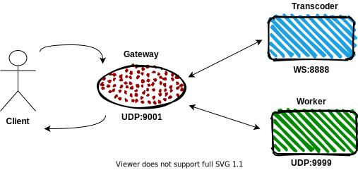

# First task

This task will show that, howe **l7mp** handle **Routing** and **Protocol Conversion**. 

## Before you begin

- You have to make sure that you have an installed minikube and you are able to 
  install the l7mp with helm. [here](./l7mp_getting_started)
- Make sure you are understand the basic conceps: `link to basic concepts`.

## About this task

This example demonstrates a simple UDP API gateway for video-game networking or 
IoT. The **worker** service is exposed to the outside world though `UDP:9001` through 
the **gateway**, with the added twist that inbound packets received from the 
Internet are processed through a **transcoder** service. This service, however, 
is reachable only via UNIX domain socket (UDS) that does not allow remote access, 
therefore the **transcoder** service will be exposed to the rest of the cluster on 
a remote access protocol `WebSocket:8888`, with the **l7mp** sidecar proxy doing proper 
protocol-conversion for the app (WS <-> UDS). (NB: Currently **l7mp** supports only 
byte-stream UDS so we will lose the original message framing at this point; 
proper datagram-stream UDS will be added later.)



### Static configuration 

#### Transcoder

Add a `transcoder` deployment, identified by the label `app:transcoder` but with 
no backing Kubernetes service, which will implement the transcoding functionality. 
Each pod will contain two containers: a container for the transcoder process 
itself that accepts connections via UDS (can be an UDS echo server for testing) 
and another `l7mp` container that implements the sidecar.

For achive this you have to create the proper deployment first, so deploy it:

```
kubectl apply -f https://l7mp.io/tasks/task1/transcoder-deployment.yaml
```

Now, you have to make sure, that the incoming traffic will be routed to the proper 
*Unix Domain Socket* file which is `/tmp/uds-echo.sock`. For this functionality 
you have to create a **UnixDomainSocket cluster** in your sidecar.

``` yaml
cat <<EOF | kubectl apply -f -
apiVersion: l7mp.io/v1
kind: Target
metadata:
  name: uds-cluster
spec:
  selector:
    matchExpressions:
      - key: app
        operator: In
        values:
        - transcoder
  cluster:
    spec:
      UnixDomainSocket:
        filename: "/tmp/uds-echo.sock" 
    endpoints:
      - spec:
          filename: "/tmp/uds-echo.sock" 
EOF
```

Please notice, that setup only use *Unix Domain Socket*, but you have to receive and 
response with *WebSocket* traffic. So create a listener inside the transcoder sidecar
which receive *WebSocket* traffic and forward to the **uds-cluster**.

``` yaml
cat <<EOF W kubectl appply -f -
apiVersion: l7mp.io/v1
kind: VirtualService
metadata:
  name: transcoder-vsvc
  namespace: default
spec:
  selector:
    matchExpressions:
      - key: app
        operator: In
        values:
        - transcoder
  listener:
    name: websocket
    spec:
      WebSocket:
        port: 8888
    rules:
      - action:
          route:
            destinationRef: /apis/l7mp.io/v1/namespaces/default/targets/uds-cluster
EOF
```

Fantastic! Now you can send and receive *WebSocket* messages from **transcoder**. 
But you cannot specify a *VirutalService/Listener* as destinatination only 
*Targets/Clusters*. So you have to create a cluster inside the **l7mp-ingress**
which can be addressed by the *Gateway VirtualService* at the end of this task.

``` yaml
cat <<EOF | kubectl apply -f -
apiVersion: l7mp.io/v1
kind: Target
metadata:
  name: websocket-cluster
spec:
  selector:
    matchExpressions:
      - key: app
        operator: In
        values:
        - l7mp-ingress
  cluster:
    spec:
      WebSocket:
        port: 8888
    loadbalancer:
      policy: ConsistentHash
    endpoints:
      - selector:
          matchLabels:
            app: transcoder
EOF
```

#### Worker

Next, add a `worker` deployment with a worker server that processes the UDP 
payloads and sends the results back (can be an UDP echo server for testing).

First create a deployment with *sidecar* and *UDP echo* server.

```
kubectl apply -f https://l7mp.io/tasks/task1/worker-deployment.yaml
```

Now you only have to create a **Target** (cluster), which receive UDP traffic on port 9999
send back. 

``` yaml
cat <<EOF | kubectl apply -f -
apiVersion: l7mp.io/v1
kind: Target
metadata:
  name: udp-cluster
spec:
  selector:
    matchExpressions:
      - key: app
        operator: In
        values:
        - l7mp-ingress
  cluster:
    spec:
      UDP:
        port: 9999
    loadbalancer:
      policy: ConsistentHash
    endpoints:
      - selector: 
          matchLabels:
            app: worker
EOF
```

Please notice the *endpoints section*. There is no concrete address or configuration of an
endpoint only a selector. So if a pod has the `app: worker` label it will be an endpoint of 
the **udp-cluster**.  

#### Gateway

Finally, you only have to connect these services together with an other *Virtual Service*.
This will be the **gateway-vsvc**, which receive traffic from **l7mp-ingress** and first 
send to the transcoder and the result from transcoder to the worker and send back the 
traffic to the client.  

``` yaml
cat <<EOF | kubectl apply -f -
apiVersion: l7mp.io/v1
kind: VirtualService
metadata:
  name: gateway-vsvc
  namespace: default
spec:
  selector:
    matchLabels: 
      app: l7mp-ingress
  listener:
    spec:
      UDP:
        port: 9001
    rules:
      - action:
          route:
            destinationRef: /apis/l7mp.io/v1/namespaces/default/targets/udp-cluster
            ingress:
              - clusterRef: /apis/l7mp.io/v1/namespaces/default/targets/websocket-cluster
EOF
```

## Test

If everything is working you have to test it. (You can use other tool for testing.)

```
socat - udp4:$(minikube ip):9001
```

You have to see something like this if you send something. 

``` 
$ socat - udp4:$(minikube ip):9001 
This is a test!
Echo on worker-deployment-6bfdf5584c-97dgn: 
Transcoded on transcoder-deployment-6784fc494c-6t7l5: This is a test!
Hurray it's working! 
Echo on worker-deployment-6bfdf5584c-97dgn: 
Transcoded on transcoder-deployment-6784fc494c-6t7l5: Hurray it's working! 
```

## Cleanup

To remove this setup use the following command: 

```
curl -LO https://l7mp.io/tasks/task1/cleanup.sh
chmod u+x cleanup.sh
./cleanup.sh
```